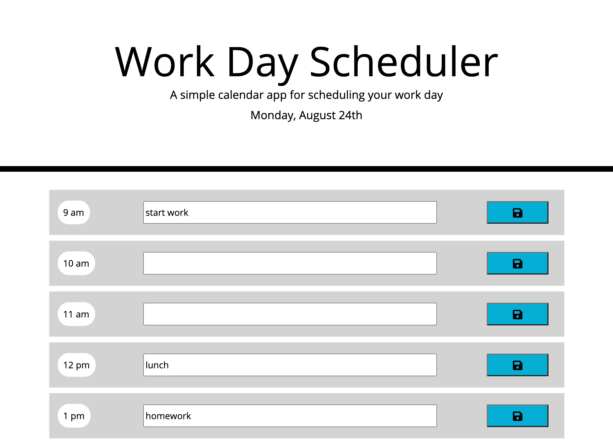

# 05 Third-Party APIs: Work Day Scheduler

Deployed application:
https://kdoh52.github.io/hw-5/ 

Screenshot:

Description:
The following website application is a work day planner. The header includes the current date and below is the 9am to 5pm schedule.

Each hour contains a block to input activities and a save button to store them in memory. These events are stored in an array in local storage.

Another feature includes color-coding to indicate how far into the day the user is. Hours in the past are colored gray, future are green, and current is red.

The design remains responsive on small and large screens.

Technologies used:
HTML, CSS, JS, Jquery, Bootstrap, FontAwesome, Moment.js

Contact:
kdoh52@gmail.com
